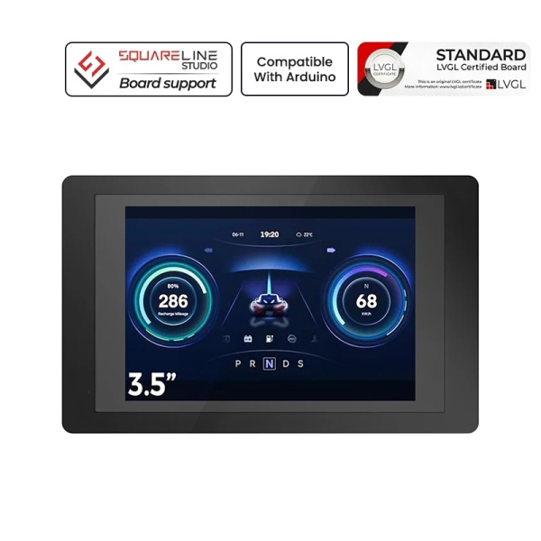
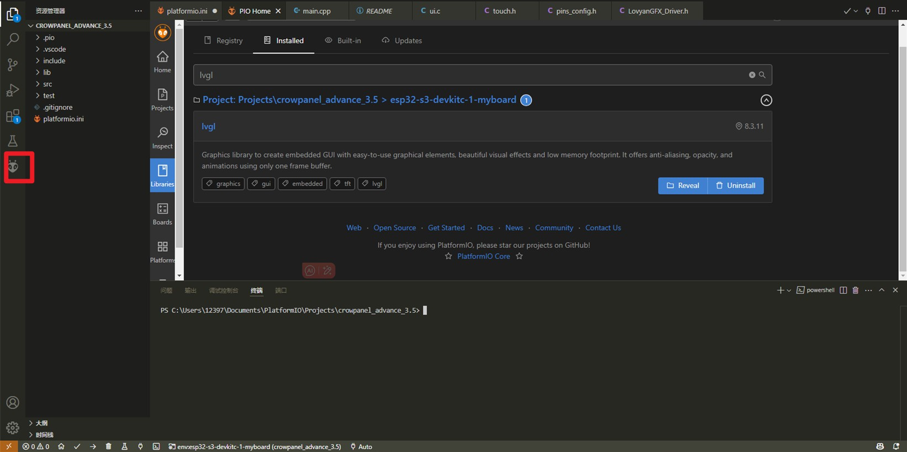
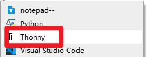
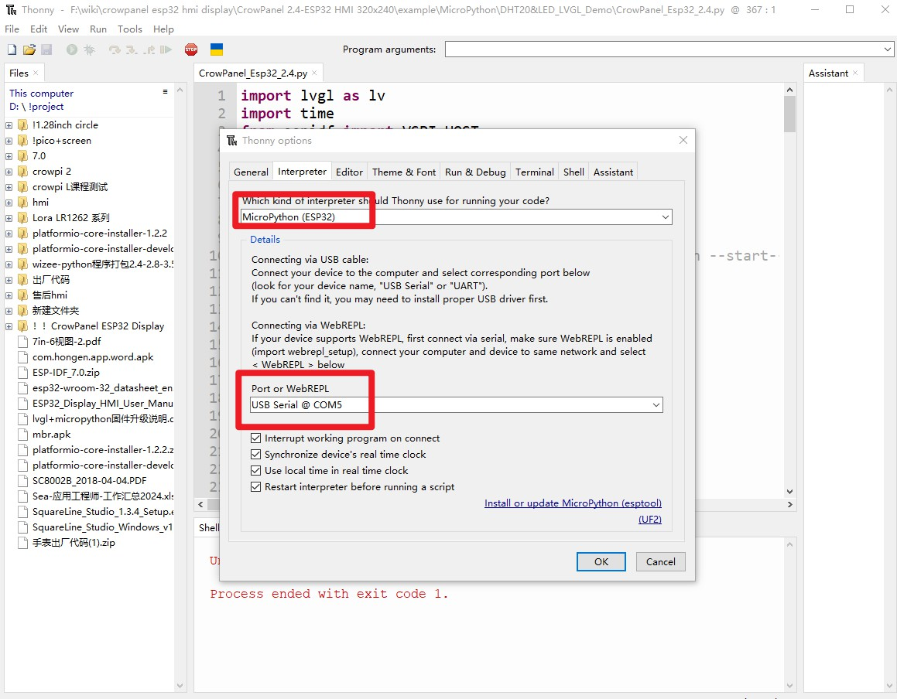

1, Product picture

2, Product version number

|      | Hardware | Software | Remark |
| ---- | -------- | -------- | ------ |
| 1    | V2.0     | V1.0     | latest |

3, product information

- ESP32-S3WROOM-1-N16R8 module with 16MB Flash and 8 MB PSRAM
- Wi-Fi Protocol: 802.11b/g/n (802.11n up to 150Mbps)
- Wi-Fi Frequency Range: 2.402GHz - 2.483Ghz
- Support Bluetooth 5
- With 4 Crowtail interfaces (HY2.0-4P connector) and on-board Micro TF card slot
- 3.5-inch TFT LCD RGB true color LCD screen with 480*320 resolution
- Driver chip: ILI9488 (16-bit parallel line)
- Capacitive touch panel controller IC FT6236 series
- Operating Voltage: DC 5V, 500mA
- Operating temperature: -10°C ~ 65°C
- Active Area: 73.63(L)x49.79mm(W)
- Appearance Dimensions: 106(L)x66mm(W)x13mm(H)

4, Use the driver module

| Name | dependency library |
| ---- | ------------------ |
| LVGL | lvgl/lvgl@8.3.3    |

5,Quick Start

##### Arduino IDE starts

1.Download the library files used by this product to the 'libraries' folder.

C:\Users\Documents\Arduino\libraries\

2.Open the Arduino IDE

3.Open the code configuration environment and burn it

##### ESP-IDF starts

1.Right-click on an empty space in the project folder and select "Open with VS Code" to open the project.

2.In the IDF plug-in, select the port, then compile and flash

##### PlatformIO starts

1.Right-click on an empty space in the project folder and select "Open with VS Code" to open the project.

2.In the PlatformIO plug-in, select the port, then compile and flash

##### Micropython starts

1,Right-click on an empty space in the project folder and select "Thonny" to open the project.

2,In thonny software, select the master and port, then run the program

6,Folder structure.

|--3D file： Contains 3D model files (.stp) for the hardware. These files can be used for visualization, enclosure design, or integration into CAD software.

|--Datasheet: Includes datasheets for components used in the project, providing detailed specifications, electrical characteristics, and pin configurations.

|--Eagle_SCH&PCB: Contains **Eagle CAD** schematic (`.sch`) and PCB layout (`.brd`) files. These are used for circuit design and PCB manufacturing.

|--example: Provides example code and projects to demonstrate how to use the hardware and libraries. These examples help users get started quickly.

|--factory_firmware: Stores pre-compiled factory firmware that can be directly flashed onto the device. This ensures the device runs the default functionality.

|--factory_sourcecode: Contains the source code for the factory firmware, allowing users to modify and rebuild the firmware as needed.

7,Pin definition

        cfg.pin_wr = 18;
        cfg.pin_rd = 48;
        cfg.pin_rs = 45;
        cfg.pin_d0 = 47;
        cfg.pin_d1 = 21;
        cfg.pin_d2 = 14;
        cfg.pin_d3 = 13;
        cfg.pin_d4 = 12;
        cfg.pin_d5 = 11;
        cfg.pin_d6 = 10;
        cfg.pin_d7 = 9;
        cfg.pin_d8 = 3;
        cfg.pin_d9 = 8;
        cfg.pin_d10 = 16;
        cfg.pin_d11 = 15;
        cfg.pin_d12 = 7;
        cfg.pin_d13 = 6;
        cfg.pin_d14 = 5;
        cfg.pin_d15 = 4;
#define SDA_FT6236 38

#define SCL_FT6236 39
